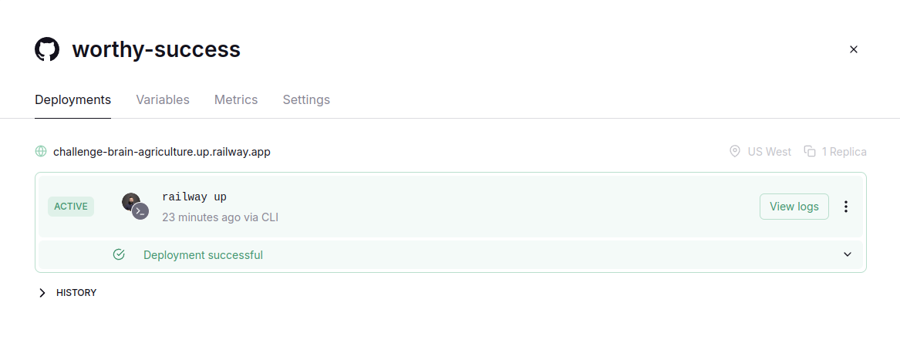
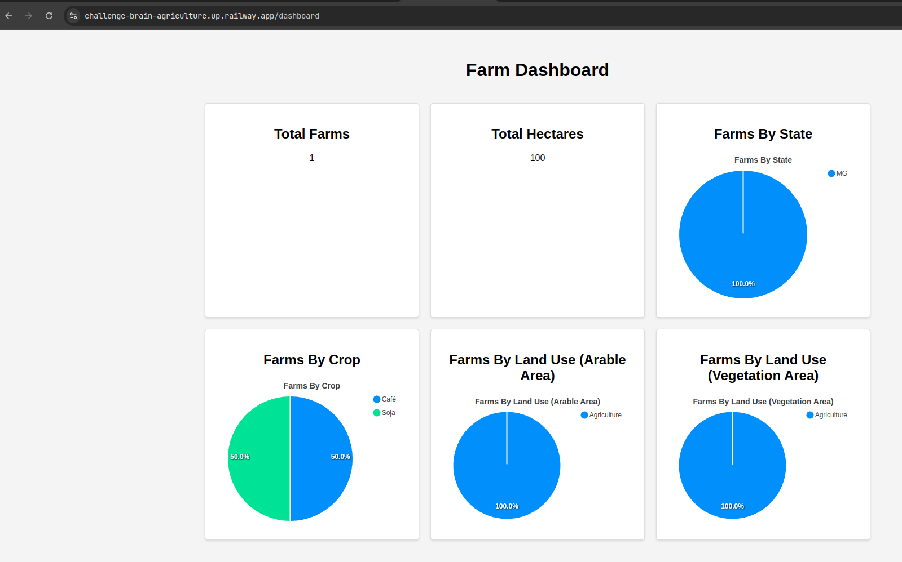

# Challenge Brain Agriculture


[Brain Agriculture - Arquitetura](./architecture.md)

[Estrutura do projeto](./structure.md)

[Endpoints/Rotas](./endpoints.md)

[Collections para usar no Postman](./collections/BrainAgriculture.postman_collection.json)

## Tecnologias usadas

- Node.js
- Typescript
- Nestjs
- Sequelize
- Postgres
- Docker
- Docker Compose
- Github Actions
- Railway
- Jest
- Swagger

## Como rodar o projeto?!

### Requisitos

- Docker
- Docker Compose
- Nvm (Node Version Manager)
- Node.js (v22.12.0)

### Passos

1. Clone the repository

```bash
git clone git@github.com:williamkoller/challenge-brain-agriculture.git
```

2. Access the project folder

```bash

cd challenge-brain-agriculture
```

3. Install the dependencies

```bash
nvm use
npm install
```

4. Run the project

```bash
docker-compose down && docker-compose up --build
```

5 - Access the project in the browser

```bash
http://localhost:3003/api/swagger
```

## Obs

- A migration roda sozinha quando starta o container da `web-api`

### Para criar uma migation

```bash
npm run migration:create <nome-da-tabela>
```

### Para rodar as migrations

```bash
npm run migration:up
```

### Para reverter as migrations

```bash
npm run migration:down
```

## Esse projeto esta na Cloud - Railway

- Criei dois Actions no Github para fazer o deploy da aplicação na Railway e para rodar a Pull Request.

- Acesse o Swagger da aplicação na Railway [Brain Agriculture](https://challenge-brain-agriculture.up.railway.app/api/swagger) as credenciais estão aqui [Credenciais](./swagger-config.txt)

- Railway 

- Criei um tela para exibir o Dashboard da aplicação [Dashboard](https://challenge-brain-agriculture.up.railway.app/dashboard)

### Dashboard



#### Esse projeto foi feito com ❤️ por William Koller
